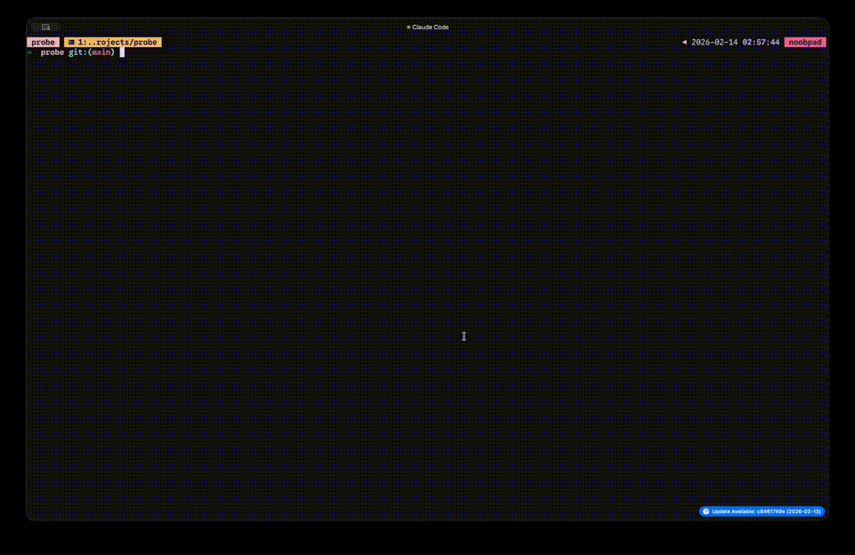

# probe

[](https://github.com/newtoallofthis123/probe/actions/workflows/ci.yml)

**Agentic code search from the command line.**

Ask a question in plain English. Get back file paths and line numbers.



## Table of Contents

- [Who is this for?](#who-is-this-for)
- [Why probe?](#why-probe)
- [Install](#install)
- [Quick start](#quick-start)
- [Usage](#usage)
- [Config file](#config-file)
- [Output formats](#output-formats)
- [Vim / Neovim integration](#vim--neovim-integration)
- [Scoped search with `--stdin`](#scoped-search-with---stdin)
- [Think mode](#think-mode)
- [Verbose mode](#verbose-mode)
- [How it works](#how-it-works)
- [Development](#development)

## Who is this for?

In the age of agentic coding, probe by itself might seem redundant — why not just let Claude Code or Cursor search for you? It turns out probe fills a gap for two kinds of people:

**If you're not fully onboard with AI agents** — probe gives you the power of agentic search without surrendering your entire workflow to an agent harness. You stay in control. The LLM does the tedious part — figuring out *where* things are — and you do the actual coding. No chat windows, no approval prompts, just results in your terminal.

**If you live in the terminal and vim** — this is why probe was built. When you're deep in a vibe-coded project and you've lost track of where things live, probe drops you straight into a quickfix list. `:cnext`, `:cprev`, done. It's the missing bridge between "I know what I want" and "I'm staring at the right line of code."

probe can also be called by other tools directly — think of it as a Claude Code skill for cheaper, faster code search. The JSON and quickfix output formats make it easy to integrate into scripts and editor plugins. Though honestly, in its current state, this is more of a future direction than a recommendation.

## Why probe?

You know what you're looking for, just not *where* it is. Grep needs you to know the exact string. IDE search needs you to know the filename. probe just needs the question.

```bash
probe "where is the rate limiting logic?"
```

```
src/middleware/ratelimit.go:18-45   Token bucket implementation with per-IP tracking
src/config/limits.go:3-11          Rate limit constants and defaults
```

No embeddings. No vector database. No indexing step. probe hands an LLM a few Unix tools — grep, find, read — and lets it search iteratively until it finds what you need.

## What makes it different

- **Zero setup** — `go install` and go. No indexing, no config files, no database
- **Any LLM** — works with Ollama locally, or OpenAI/Groq/OpenRouter in the cloud
- **Pipe-friendly** — stdout has results, stderr has everything else. Plays nice with Unix
- **Read-only** — probe never writes to your codebase. All paths are sandboxed
- **Fast** — small models (3B) work great. Most searches finish in under 5 seconds

## Install

Requires [Go 1.24+](https://go.dev/dl/) and [ripgrep](https://github.com/BurntSushi/ripgrep#installation).

```bash
go install github.com/newtoallofthis/probe@latest
```

Or grab a binary from [Releases](https://github.com/newtoallofthis123/probe/releases).

## Quick start

probe connects to any OpenAI-compatible API. The fastest way to get started is with [Ollama](https://ollama.com) running locally:

```bash
# Pull a model
ollama pull ministral-3:3b

# Search your codebase
cd your-project
probe "where are the database migrations?"
```

That's it. No config files needed. probe auto-detects your project language, respects `.gitignore`, and searches from the current directory.

### Using a cloud provider

Point probe at any OpenAI-compatible endpoint:

```bash
# OpenAI
export PROBE_API_KEY="sk-..."
export PROBE_BASE_URL="https://api.openai.com/v1"
export PROBE_MODEL="gpt-4o-mini"

# Anthropic (via OpenRouter)
export PROBE_API_KEY="sk-or-..."
export PROBE_BASE_URL="https://openrouter.ai/api/v1"
export PROBE_MODEL="anthropic/claude-sonnet-4-20250514"

# Groq
export PROBE_API_KEY="gsk_..."
export PROBE_BASE_URL="https://api.groq.com/openai/v1"
export PROBE_MODEL="llama-3.3-70b-versatile"

probe "how does the rate limiter work?"
```

## Usage

```
probe [flags] <query>
```

### Flags

| Flag | Description | Default |
|---|---|---|
| `--model <name>` | Model name | `ministral-3:3b` |
| `--base-url <url>` | API base URL | `http://localhost:11434/v1` |
| `--max-turns <n>` | Maximum agent turns | `10` |
| `--dir <path>` | Project directory to search | `.` |
| `--json` | Output results as JSON | |
| `--format <fmt>` | Output format: `human`, `json`, `paths`, `qf` | `human` |
| `-t`, `--think` | Thorough search mode (more turns, deeper verification) | |
| `--stdin` | Read file list from stdin to scope the search | |
| `-v`, `--verbose` | Show agent search trace on stderr | |
| `-q`, `--quiet` | Suppress all stderr output | |
| `--version` | Print version and exit | |

### Environment variables

| Variable | Description |
|---|---|
| `PROBE_API_KEY` | API key for the LLM provider |
| `PROBE_MODEL` | Default model name |
| `PROBE_BASE_URL` | Default API base URL |
| `PROBE_MAX_TURNS` | Default max turns |
| `PROBE_THINK` | Enable think mode (`1` or `true`) |

Precedence: flags > environment variables > config file > defaults.

## Config file

probe looks for a TOML config file in these locations (first found wins):

1. `.probe.toml` in the project directory — per-project settings
2. `$XDG_CONFIG_HOME/probe/config.toml`
3. `~/.config/probe/config.toml` — global defaults

```toml
# ~/.config/probe/config.toml
model = "gpt-4o-mini"
base_url = "https://api.openai.com/v1"
api_key_env = "OPENAI_API_KEY"    # reads the key from this env var
max_turns = 15
output_format = "human"
show_reasons = true
think = false
```

Drop a `.probe.toml` in any project root to override globals for that repo:

```toml
# myproject/.probe.toml
model = "llama-3.3-70b-versatile"
max_turns = 20
think = true
```

## Output formats

### Human (default)

When stdout is a terminal, results include file paths, line ranges, and reasons with color:

```
src/middleware/auth.ts:14-58     Defines verifyToken() and requireAdmin()
src/utils/jwt.ts:3-22           JWT signing and verification helpers
```

When piped, reasons and colors are stripped automatically:

```bash
probe "auth middleware" | head -1
# src/middleware/auth.ts:14-58
```

### JSON

```bash
probe --json "auth middleware"
```

```json
{
  "results": [
    {
      "file": "src/middleware/auth.ts",
      "start_line": 14,
      "end_line": 58,
      "reason": "Defines verifyToken() and requireAdmin()"
    }
  ],
  "summary": "Found auth middleware and JWT helpers",
  "turns": 3
}
```

### Paths

Deduplicated file paths, one per line. Designed for `xargs`:

```bash
probe --format=paths "auth" | xargs wc -l
```

### Quickfix

Vim/Neovim quickfix-compatible format (`file:line:col: message`). Load results directly into your editor's quickfix list:

```bash
probe --format=qf "auth middleware" | vim -q /dev/stdin
```

## Vim / Neovim integration

probe's quickfix format (`--format=qf`) makes it a first-class citizen in Vim and Neovim.

### As a `:grep` replacement

Set probe as your `grepprg` and search with `:grep` as usual:

```vim
" In your vimrc / init.vim
set grepprg=probe\ --format=qf
set grepformat=%f:%l:%c:\ %m
```

Now `:grep "where is the auth middleware?"` populates the quickfix list. Navigate with `:cnext` / `:cprev`.

### One-off search

Run probe from command mode and jump straight to results:

```vim
:cexpr system('probe --format=qf "error handling"')
:copen
```

### From the shell into Vim

```bash
# Open vim with probe results in the quickfix list
probe --format=qf "auth middleware" | vim -q /dev/stdin

# Or with Neovim
probe --format=qf "auth middleware" | nvim -q /dev/stdin
```

## Scoped search with `--stdin`

Pipe a file list into probe to restrict the search scope. Useful for searching only staged files, recently changed files, or a specific subset:

```bash
# Search only git-staged files
git diff --cached --name-only | probe --stdin "TODO comments"

# Search only files changed in the last week
git log --since="1 week ago" --name-only --format="" | sort -u | probe --stdin "deprecated API calls"

# Search specific files
find src/api -name "*.go" | probe --stdin "where is the rate limiter?"
```

## Think mode

For complex questions that need deeper investigation, use `-t` / `--think`:

```bash
probe -t "how does the billing system calculate prorated charges?"
```

Think mode gives the agent more turns and encourages it to verify findings by cross-referencing related files — imports, configs, tests — before submitting an answer. It's slower but more thorough.

## Verbose mode

See what the agent is doing in real time:

```bash
probe -v "where is main?"
```

```
⠋ Searching...
├─ grep func\s+main
│  → 2 matches
├─ read main.go:1-50
│  → 50 lines
│  tokens: +512/+128 (total: 640)
├─ submit_answer
✓ Done (3 turns, 1.8s)
main.go:28-36    CLI entrypoint and orchestration
```

## Exit codes

| Code | Meaning |
|---|---|
| `0` | Results found |
| `1` | No results found |
| `2` | Error (bad config, API unreachable, etc.) |

Follows grep conventions, so probe works naturally in scripts:

```bash
probe "auth" && echo "found" || echo "nothing"
```

## How it works

probe is an agent loop. It sends your query to an LLM along with your project's directory tree, then lets the LLM iteratively call search tools until it finds what you asked for:

```
User query → System prompt (project tree, language hints)
                │
                ▼
         Agent loop (up to --max-turns):
                │
                ├─ LLM picks tools to call
                ├─ Tools run in parallel
                ├─ Results fed back to LLM
                └─ Repeat until submit_answer
                │
                ▼
         Format and print results
```

The LLM has five tools:

| Tool | Purpose |
|---|---|
| `grep` | Search file contents with ripgrep (regex, globs) |
| `find_files` | Discover files/directories by pattern |
| `read_file` | Read file contents with line numbers |
| `list_dir` | List directory tree |
| `submit_answer` | Return final results with file locations |

All tools are **read-only** and **sandboxed** to the project directory. Results are filtered through `.gitignore` and truncated with feedback so the LLM knows its view is partial.

## Development

See [Architecture](docs/architecture.md) for project structure. Requires [just](https://github.com/casey/just) as a task runner.

```bash
just build          # compile the binary
just test           # run all tests
just test-one Name  # run a single test
just ci             # fmt + vet + test
just run "query"    # build and run
just run-v "query"  # run with verbose
```

## License

MIT
